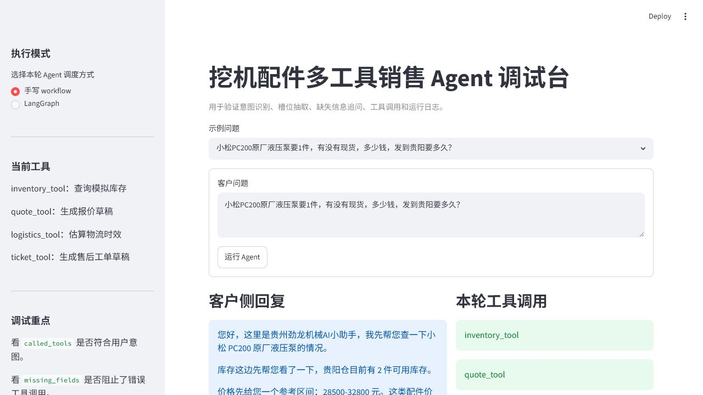

# 挖机配件多工具销售 Agent

这是项目一“企业知识库 RAG 客服”的下一阶段：从“基于资料回答问题”升级到“按业务流程调用工具办事”。

## 项目定位

面向工程机械配件销售、报价、物流和售后场景的多工具 Agent。系统会先解析客户问题，识别意图并抽取槽位；信息不足时主动追问；信息完整时调用确定性工具查询库存、生成报价草稿、估算物流或生成售后工单草稿；最后组织成客户能看懂的客服回复。

典型输入：

```text
小松PC200原厂液压泵要1件，有没有现货，多少钱，发到贵阳要多久？
```

系统会完成：

- 识别意图：库存查询、报价查询、物流估算。
- 抽取槽位：品牌、设备型号、配件名称、品质档位、数量、城市。
- 调用工具：`inventory_tool`、`quote_tool`、`logistics_tool`。
- 生成客户回复，并在内部保留解析结果、工具参数和工具返回值。

## 当前能力

- 规则型意图识别：库存、报价、物流、售后、适配、故障诊断。
- 槽位抽取：品牌、型号、配件名、品质档位、数量、城市、急用程度、订单号。
- 缺失字段追问：缺品质档位、数量、订单号等信息时阻止错误工具调用。
- 库存工具：基于 `data/inventory.csv` 查询模拟库存。
- 报价工具：基于模拟价格区间生成报价草稿。
- 物流工具：基于 `data/logistics_rules.csv` 估算时效和运费。
- 售后工单工具：根据订单号生成售后工单草稿，不直接承诺退货、退款或换货结论。
- Pydantic 工具参数 schema：在 workflow 调用工具前校验库存、报价、物流和售后工单参数。
- 两套执行方式：手写 workflow 与 LangGraph workflow。
- 运行日志：记录问题、意图、槽位、工具参数、工具结果和客户回复，便于回放和 badcase 分析。
- 可解释执行轨迹：每轮输出 `execution_trace`，按顺序记录解析、缺失字段拦截、工具调用和回复生成步骤。
- 30 条测试集：覆盖库存、报价、物流、售后、混合意图和信息不足追问。
- 5 条可解释性专项测试：验证执行轨迹、工具顺序、状态流转和客户回复不暴露内部字段。

## 目录结构

```text
project2/
  app.py                         # Streamlit 调试台
  agent_parser.py                # 意图识别与槽位抽取
  agent_workflow.py              # 手写 workflow
  agent_graph.py                 # LangGraph workflow
  tool_dispatcher.py             # 统一工具参数构造与调用
  response_builder.py            # 客户侧回复生成
  execution_trace.py             # 执行轨迹构造
  schemas.py                     # Pydantic 工具参数 schema
  tool_call_logger.py            # 工具调用日志
  data/
    inventory.csv                # 模拟库存与价格区间
    logistics_rules.csv          # 模拟物流规则
  tools/
    inventory_tool.py            # 库存查询工具
    quote_tool.py                # 报价工具
    logistics_tool.py            # 物流估算工具
    ticket_tool.py               # 售后工单草稿工具
  tests/
    agent_cases.jsonl            # 30 条测试集
    agent_observability_cases.jsonl # 5 条可解释性测试集
    evaluate_agent.py            # 批量评估脚本
  docs/
    multi_tool_agent_flow.md     # 多工具 Agent 流程图
    langgraph_flow.md            # LangGraph 流程说明
```

## 运行调试台

```powershell
cd "D:\new things\项目1\day1\project2"
& "..\.venv\Scripts\streamlit.exe" run app.py --server.port 8503
```

打开：

```text
http://127.0.0.1:8503
```

调试台截图：



调试台可以切换“手写 workflow”和“LangGraph”，并查看：

- 客户侧回复
- 执行轨迹
- 解析结果
- 工具参数
- 工具结果
- 历史运行日志
- 完整 JSON

## 微信聊天助手入口

当前已新增本地微信 webhook 适配层：

```text
wechat_server.py
```

它负责微信服务器验签、解析文本消息 XML、调用项目二 Agent，并返回微信文本 XML。启动方式：

```powershell
cd "D:\new things\项目1\day1\project2"
& "..\.venv\Scripts\python.exe" wechat_server.py --port 8510 --token project2-agent-token --mode graph
```

本地模拟微信请求：

```powershell
& "..\.venv\Scripts\python.exe" tests\simulate_wechat.py --url http://127.0.0.1:8510 --token project2-agent-token
```

真实微信公众号接入需要公网 HTTPS URL，不能直接使用 `127.0.0.1`。详细说明见：

```text
docs/wechat_integration.md
docs/wechat_real_connection_checklist.md
```

## 命令行验证

库存工具：

```powershell
& "..\.venv\Scripts\python.exe" tools\inventory_tool.py --machine-model PC200 --part-name 液压泵 --quality-level 原厂 --brand 小松
```

报价工具：

```powershell
& "..\.venv\Scripts\python.exe" tools\quote_tool.py --machine-model PC200 --part-name 液压泵 --quality-level 原厂 --quantity 1 --brand 小松
```

售后工单工具：

```powershell
& "..\.venv\Scripts\python.exe" tools\ticket_tool.py --order-id A20260616001 --question "订单号 A20260616001，买错了能不能退货？"
```

完整 workflow：

```powershell
& "..\.venv\Scripts\python.exe" agent_workflow.py "小松PC200原厂液压泵要1件，有没有现货，多少钱，发到贵阳要多久？"
```

## 批量评估

手写 workflow：

```powershell
& "..\.venv\Scripts\python.exe" tests\evaluate_agent.py --mode workflow
```

LangGraph：

```powershell
& "..\.venv\Scripts\python.exe" tests\evaluate_agent.py --mode graph
```

执行轨迹专项测试：

```powershell
& "..\.venv\Scripts\python.exe" tests\evaluate_agent.py --cases tests\agent_observability_cases.jsonl --mode workflow
& "..\.venv\Scripts\python.exe" tests\evaluate_agent.py --cases tests\agent_observability_cases.jsonl --mode graph
```

当前评估结果：

- workflow：30/30，通过率 100.0%。
- LangGraph：30/30，通过率 100.0%。
- workflow 可解释性专项：5/5，通过率 100.0%。
- LangGraph 可解释性专项：5/5，通过率 100.0%。

## 演示路径

面试或作品集演示时，可以按 `docs/demo_script.md` 走一遍：先展示混合意图问题如何调用库存、报价和物流工具，再展示执行轨迹如何解释每一步决策；然后展示信息不足时如何追问，最后展示售后工单和运行日志回放。

## 面试表达

项目一解决的是企业知识库 RAG 问答，项目二解决的是多工具 Agent 执行流程。真实客服不只需要回答问题，还需要查库存、算报价、估物流、建工单和转人工，所以我把系统拆成三层：解析层负责意图识别和槽位抽取，工具层负责确定性查询和草稿生成，workflow 层负责缺信息追问、工具调度和结果汇总。

我没有让模型直接编库存或价格，而是让库存、报价、物流和售后这类关键动作由服务端工具执行。低风险信息可以自动查询，高风险售后动作只生成工单草稿，必须人工确认。后续又用 LangGraph 把 State、Node、Edge 显式表达出来，方便多步骤流程的测试、扩展和排错。

## 简历写法

挖机配件多工具销售 Agent

- 基于 Python、Streamlit 和 LangGraph 构建工程机械配件多工具 Agent，实现意图识别、槽位抽取、缺失字段追问和工具调度。
- 设计库存查询、报价草稿、物流估算和售后工单四类确定性工具，并使用 Pydantic schema 校验工具参数，避免模型直接编造库存、价格和售后结论。
- 实现手写 workflow 与 LangGraph 两套执行链路，将任务状态、工具结果和失败分支显式化，提升 Agent 流程可解释性。
- 增加工具调用日志与执行轨迹，记录用户问题、意图、槽位、工具参数、工具结果、决策步骤和客户回复，支持历史回放与 badcase 分析。
- 构建 30 条多工具 Agent 测试集与 5 条可解释性专项测试，验证意图识别、工具选择、缺失字段追问、槽位抽取、执行轨迹和客户回复质量。
