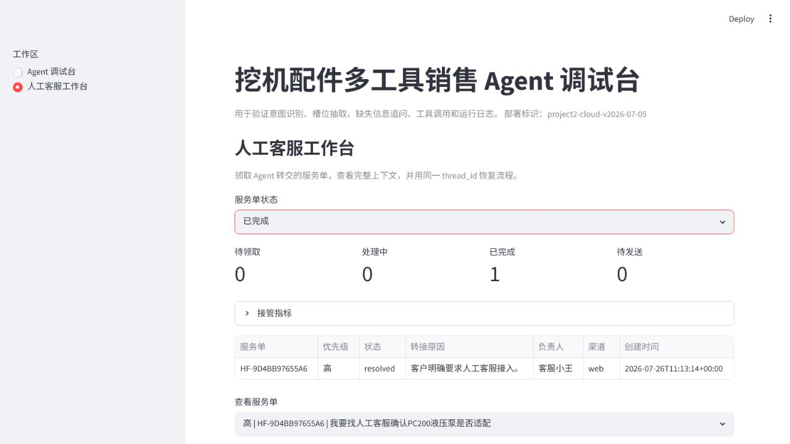
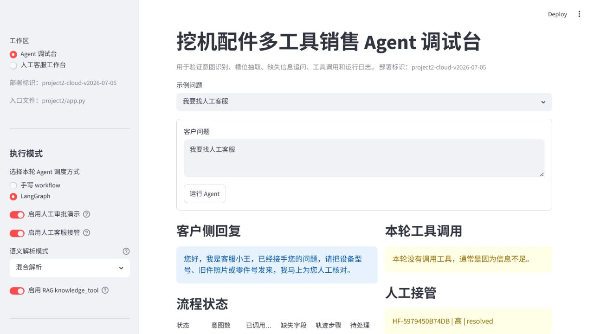

# 挖机配件多工具销售 Agent

这是项目一“企业知识库 RAG 客服”的下一阶段：从“基于资料回答问题”升级到“按业务流程调用工具办事”。

## 项目定位

面向工程机械配件销售、报价、物流和售后场景的多工具 Agent。LangGraph 负责状态、动态路由、图片确认、暂停恢复和失败分支；LangChain 负责混合语义解析、结构化输出和标准工具 schema；项目一 RAG 被封装成 `knowledge_tool`。文本继续使用 DeepSeek，图片由独立智谱视觉路由提取候选证据。AI 无法可靠完成问题时，系统会创建人工服务单、携带完整上下文暂停，等待人工客服回复后从同一 `thread_id` 恢复。

典型输入：

```text
小松PC200原厂液压泵要1件，有没有现货，多少钱，发到贵阳要多久？
```

系统会完成：

- 识别意图：库存查询、报价查询、物流估算。
- 抽取槽位：品牌、设备型号、配件名称、品质档位、数量、城市。
- 调用工具：`inventory_tool`、`quote_tool`、`logistics_tool`。
- 生成客户回复，并在内部保留解析结果、工具参数和工具返回值。

## 当前能力

- 规则型意图识别：库存、报价、物流、售后、适配、故障诊断。
- LangChain 混合解析：规则高置信度时直接使用规则；低置信度时使用 ChatModel + Pydantic structured output，失败自动回退。
- ModelRouter：文本与视觉模型按能力解耦，当前文本路由保持 DeepSeek，视觉路由已接通智谱 `glm-4.1v-thinking-flash`，并保留千问和腾讯 TokenHub 配置入口。
- Harness 第一阶段：统一模型超时、重试、错误分类、同步并发、每轮调用/Token/估算费用预算和脱敏 telemetry。
- 多模态图片入口：Streamlit 支持每轮最多 3 张 JPG/PNG/WebP，组合校验扩展名、MIME、真实格式、大小、像素、尺寸和动画状态，并清理 EXIF 后重编码。
- 图片结构化证据：`ImageInspectionResult` 提取铭牌、旧件标签、品牌、机型、配件名、零件号、损坏现象、图片质量、置信度和补拍建议。
- 图片确认与接管：LangGraph `inspect_image -> confirm_image -> parse` 使用 checkpoint 暂停；客户可确认、编辑、拒绝或转人工，低清图片和 Provider 失败不会静默写入业务槽位。
- 图片证据治理：原图独立于 State 保存在短期证据仓库，SQLite 只保存元数据，按客户隔离并支持过期删除；日志和 checkpoint 不保存图片二进制。
- 槽位抽取：品牌、型号、配件名、零件号、品质档位、数量、城市、急用程度、订单号。
- 缺失字段追问：缺品质档位、数量、订单号等信息时阻止错误工具调用。
- 库存工具：基于 `data/inventory.csv` 查询模拟库存。
- 报价工具：基于模拟价格区间生成报价草稿。
- 物流工具：基于 `data/logistics_rules.csv` 估算时效和运费。
- 售后工单工具：根据订单号生成售后工单草稿，不直接承诺退货、退款或换货结论。
- RAG 知识工具：复用项目一 Chroma、中文 Embedding、Top-K、距离阈值和来源元数据。
- LangChain StructuredTool：五个工具共享现有 Pydantic schema，模型只能提出结构化计划，执行仍由 LangGraph 策略控制。
- Pydantic 工具参数 schema：在 workflow 调用工具前校验库存、报价、物流和售后工单参数。
- 两套执行方式：手写 workflow 与 LangGraph workflow。
- 动态工具路由：LangGraph 按 `tool_queue` 只执行本轮真正需要的工具，不再固定穿过所有工具节点。
- SQLite checkpoint：每个图步骤按 `thread_id` 持久化，可查看状态历史并跨进程恢复。
- 多轮短期记忆：同一 `thread_id` 保存近期消息、会话摘要、轮数和已确认槽位，进程重启后仍可继续理解省略指代。
- 多会话目录：按客户列出、打开、重命名、归档和恢复旧线程，重新打开后从原 checkpoint 继续；目录层和 State 层都校验客户归属。
- 受控上下文：按安全规则、当前问题、已确认客户信息、RAG、工具结果、近期消息和历史摘要的优先级装配，并限制 Token 预算。
- 长期客户记忆：只保存品牌、机型、品质偏好和城市白名单字段，支持客户隔离、纠错、软删除、过期和敏感信息拒绝。
- Prompt Injection 防护：RAG、工具输出和历史消息按不可信数据处理，检测到越权指令时记录信号但不提升其优先级。
- Human-in-the-loop：手动审批模式下，报价和售后工单会在工具执行前暂停，支持批准、修改后批准和拒绝。
- 人工客服接管：明确要求人工、工具失败、无可靠结果、售后、适配/诊断和重复缺信息时创建服务单。
- 人工工作台：支持队列筛选、优先级、领取、上下文查看、人工回复、同线程恢复和结单。
- 异步 Outbox：微信等非网页渠道的人工回复先以幂等消息进入待发送队列，真实渠道适配器负责最终投递。
- 节点重试与失败兜底：临时连接类异常最多重试 3 次，不可重试错误进入可解释的客户兜底回复。
- 幂等执行记录：为每次工具调用生成稳定 `idempotency_key`，恢复或重放时避免重复执行已有结果。
- 运行日志：记录问题、意图、槽位、工具参数、工具结果和客户回复，便于回放和 badcase 分析。
- 可解释执行轨迹：每轮输出 `execution_trace`，按顺序记录解析、缺失字段拦截、工具调用和回复生成步骤。
- 30 条测试集：覆盖库存、报价、物流、售后、混合意图和信息不足追问。
- 5 条可解释性专项测试：验证执行轨迹、工具顺序、状态流转和客户回复不暴露内部字段。
- 6 条 LangGraph 运行时专项测试：覆盖 checkpoint、跨实例恢复、审批修改/拒绝、重试、失败兜底和幂等复用。
- 7 条上下文与记忆专项测试：覆盖多轮指代、重启恢复、压缩预算、冲突、注入、跨线程记忆和记忆治理。
- 6 条人工接管运行时测试、7 条 LangChain/RAG 集成测试、12 条 Harness 专项测试、10 条多模态运行时测试、10 条多模态数据/指标测试、6 条多会话测试、3 条双人盲审测试和 9 条人工接管策略评测。
- 16 本断点学习 Notebook：从项目架构、RAG、LangChain/LangGraph 到多模态、标注、部署和面试题；全部包含可执行断言、逐题参考答案与代码落点，并已自动验收 16/16。
- 首批 4 张合成图片真实 API 冒烟评测：铭牌、零件标签、损坏证据和模糊拒识 4/4；该结果只证明接口、schema 和安全门控跑通，不代表真实业务准确率。
- 40 张开放许可真实机械图片候选：已完成来源/许可清单、EXIF 清理、SHA-256、联系表、双人标注模板、gold 门禁和字段/拒识指标；候选预跑不计作准确率。

## 目录结构

```text
project2/
  app.py                         # Streamlit 调试台
  agent_parser.py                # 意图识别与槽位抽取
  agent_workflow.py              # 手写 workflow
  agent_graph.py                 # LangGraph workflow
  langchain_adapter.py           # 规则优先的 LangChain 混合解析
  langchain_tools.py             # LangChain StructuredTool 目录
  model_router.py                # 文本/视觉 Provider 路由与配置
  agent_harness.py               # 模型预算、重试、错误分类和安全日志
  vision_service.py              # 视觉提示词、结构化解析和安全门控
  image_evidence.py              # 图片校验、清洗、隔离存储与过期删除
  multimodal_evaluation.py       # 字段混淆矩阵、拒识率、分层与延迟指标
  context_manager.py             # 上下文优先级、预算、压缩与注入检测
  memory_repository.py           # 客户长期记忆与审计 SQLite 仓库
  conversation_repository.py     # 会话列表、标题、归档与客户隔离
  handoff_policy.py              # 确定性人工接管策略
  handoff_repository.py          # 人工服务单与 outbox SQLite 仓库
  handoff_metrics.py             # 接管原因、解决率和处理时长指标
  tool_dispatcher.py             # 统一工具参数构造与调用
  response_builder.py            # 客户侧回复生成
  execution_trace.py             # 执行轨迹构造
  schemas.py                     # Pydantic 工具参数 schema
  tool_call_logger.py            # 工具调用日志
  notebooks/
    00_总目录与项目架构.ipynb      # 从零认识项目和两条主链路
    01_...15_*.ipynb             # 分阶段代码、验收和面试复盘
    README.md                    # 初学者运行顺序与成功判据
    ACCEPTANCE.md                # 全量 Notebook 自动执行结果
    build_notebooks.py           # 可复现生成 16 本 Notebook
    execute_notebooks.py         # 逐本执行并保存输出
  data/
    inventory.csv                # 模拟库存与价格区间
    logistics_rules.csv          # 模拟物流规则
  tools/
    inventory_tool.py            # 库存查询工具
    quote_tool.py                # 报价工具
    logistics_tool.py            # 物流估算工具
    ticket_tool.py               # 售后工单草稿工具
    knowledge_tool.py            # 项目一 RAG 适配工具
  tests/
    agent_cases.jsonl            # 30 条测试集
    agent_observability_cases.jsonl # 5 条可解释性测试集
    evaluate_agent.py            # 批量评估脚本
    test_langgraph_runtime.py     # 6 条 checkpoint/HITL/重试/幂等测试
    test_context_memory.py        # 7 条上下文与记忆治理测试
    test_conversation_sessions.py # 6 条多会话目录与恢复测试
    test_handoff_runtime.py       # 6 条人工接管与 outbox 测试
    test_langchain_integration.py # 7 条 LangChain/RAG 集成测试
    test_model_harness.py         # 12 条 ModelRouter/Harness 专项测试
    test_multimodal_runtime.py    # 10 条图片校验、隔离、确认和接管测试
    multimodal_cases.jsonl        # 首批 4 条合成图片评测集
    evaluate_multimodal.py        # 真实视觉 API 评测脚本
    collect_public_multimodal.py  # 开放许可真实候选采集、清洗与联系表
    multimodal_real_candidates.jsonl # 40 条真实迁移候选和来源元数据
    multimodal_real_annotation_template.csv # 双人标注与裁决模板
    prepare_multimodal_review.py # 合并模型预标注与人工复核栏
    prepare_multimodal_double_review.py # 双人盲审分包、合并和冲突表
    build_multimodal_gold.py      # 正式数据集许可/隐私/标注门禁
    test_multimodal_double_review.py # 3 条双人盲审流程测试
    fixtures/multimodal/          # 合成铭牌、标签、损坏和模糊图
    handoff_cases.jsonl           # 9 条人工接管策略用例
    evaluate_handoffs.py          # 人工接管策略评测脚本
  logs/
    langgraph_checkpoints.sqlite3 # 本地 checkpoint，运行后生成且不提交 Git
    handoff_cases.sqlite3         # 人工服务单和 outbox，运行后生成且不提交 Git
    agent_memory.sqlite3          # 跨线程客户长期记忆，运行后生成且不提交 Git
    conversation_threads.sqlite3  # 产品层多会话目录，运行后生成且不提交 Git
  docs/
    multi_tool_agent_flow.md     # 多工具 Agent 流程图
    langgraph_flow.md            # LangGraph 流程说明
    langchain_integration.md      # LangChain 组合边界
    human_handoff.md              # 人工客服接管设计与验收
    context_memory.md             # 上下文、多轮记忆与手动验收
    conversation_sessions.md      # 多会话目录、旧会话恢复与验收
    web_session_architecture.md   # Streamlit/FastAPI/LangSmith 与多会话方案
    model_harness.md              # ModelRouter、Harness 与免费视觉模型配置
    multimodal_mvp.md             # 已实现多模态架构、边界和验收
    multimodal_real_evaluation.md # 真实候选、gold 门禁和字段级验收
    multimodal_web_search_roadmap.md # 多模态、网页搜索与模型路由方案
```

## 断点学习 Notebook

从 [notebooks/README.md](notebooks/README.md) 开始，按 `00` 到 `15` 逐本运行。Notebook 使用专用内核 `Python (.venv 项目1 Agent)`，默认不调用真实线上模型；每个关键单元都用 `[PASS]` / `[FAIL]` 明确说明是否达到成功标准。

自动重放全部 Notebook：

```powershell
cd "D:\new things\项目1\day1\project2"
& "..\.venv\Scripts\python.exe" "notebooks\execute_notebooks.py" --timeout 300
```

当前全量结果见 [notebooks/ACCEPTANCE.md](notebooks/ACCEPTANCE.md)：16/16 通过。

## 运行调试台

```powershell
cd "D:\new things\项目1\day1\project2"
& "..\.venv\Scripts\streamlit.exe" run app.py --server.port 8503
```

打开：

```text
http://127.0.0.1:8503
```

人工客服工作台已完成服务单：



人工回复写回原 LangGraph 线程：



调试台可以切换“Agent 调试台”和“人工客服工作台”，Agent 调试台还可以切换手写 workflow/LangGraph、解析模式、RAG 和人工接管：

- 客户侧回复
- 执行轨迹
- 解析结果
- 工具参数
- 工具结果
- 历史运行日志
- 人工审批：批准、修改后批准、拒绝
- 最新 StateSnapshot 和 checkpoint 历史
- 同一线程的近期消息、历史摘要、槽位来源和冲突记录
- 上下文 Token 预算、截断区段和 Prompt Injection 信号
- 客户长期记忆及本轮受治理的写入记录
- 图片候选字段、模型路由、质量/置信度、客户确认和已合并槽位
- 工具错误、跳过工具和幂等键
- 人工服务单、转接原因、优先级、负责人和人工回复
- 接管原因分布、解决率、平均处理时长和建议回复采用率
- 非网页渠道待发送 outbox
- 完整 JSON

## 微信聊天助手入口

当前已新增本地微信 webhook 适配层：

```text
wechat_server.py
```

它负责微信服务器验签、解析文本消息 XML、调用项目二 Agent，并返回微信文本 XML。启动方式：

```powershell
cd "D:\new things\项目1\day1\project2"
& "..\.venv\Scripts\python.exe" wechat_server.py --port 8510 --token project2-agent-token --mode graph
```

本地模拟微信请求：

```powershell
& "..\.venv\Scripts\python.exe" tests\simulate_wechat.py --url http://127.0.0.1:8510 --token project2-agent-token
```

真实微信公众号接入需要公网 HTTPS URL，不能直接使用 `127.0.0.1`。详细说明见：

```text
docs/wechat_integration.md
docs/wechat_real_connection_checklist.md
```

## 命令行验证

库存工具：

```powershell
& "..\.venv\Scripts\python.exe" tools\inventory_tool.py --machine-model PC200 --part-name 液压泵 --quality-level 原厂 --brand 小松
```

报价工具：

```powershell
& "..\.venv\Scripts\python.exe" tools\quote_tool.py --machine-model PC200 --part-name 液压泵 --quality-level 原厂 --quantity 1 --brand 小松
```

售后工单工具：

```powershell
& "..\.venv\Scripts\python.exe" tools\ticket_tool.py --order-id A20260616001 --question "订单号 A20260616001，买错了能不能退货？"
```

完整 workflow：

```powershell
& "..\.venv\Scripts\python.exe" agent_workflow.py "小松PC200原厂液压泵要1件，有没有现货，多少钱，发到贵阳要多久？"
```

LangGraph 自动审批兼容模式：

```powershell
& "..\.venv\Scripts\python.exe" agent_graph.py "小松PC200原厂液压泵要1件，有没有现货，多少钱，发到贵阳要多久？"
```

LangGraph 手动审批模式：

```powershell
& "..\.venv\Scripts\python.exe" agent_graph.py "PC200原厂液压泵要1件，价格多少？" --thread-id demo-quote-001 --manual-approval
```

第一次运行会输出 `waiting_approval`。使用相同 `thread_id` 批准并恢复：

```powershell
& "..\.venv\Scripts\python.exe" agent_graph.py --thread-id demo-quote-001 --resume approve --comment "参数已核对"
```

也可以使用 `--resume reject` 拒绝，或使用 `--resume edit --edited-arguments '{...}'` 修改参数后批准。

LangGraph 人工客服接管：

```powershell
& "..\.venv\Scripts\python.exe" agent_graph.py "我要找人工客服确认PC200液压泵" --thread-id demo-handoff-001 --enable-handoff --parser-mode hybrid --enable-knowledge
```

第一次运行输出 `waiting_human` 和 `handoff_id`。人工客服使用同一个 `thread_id` 回复并恢复：

```powershell
& "..\.venv\Scripts\python.exe" agent_graph.py --thread-id demo-handoff-001 --human-reply "您好，我已经接手，接下来帮您核对铭牌、旧件照片和零件号。" --agent-name "客服小王"
```

## 批量评估

手写 workflow：

```powershell
& "..\.venv\Scripts\python.exe" tests\evaluate_agent.py --mode workflow
```

LangGraph：

```powershell
& "..\.venv\Scripts\python.exe" tests\evaluate_agent.py --mode graph
```

执行轨迹专项测试：

```powershell
& "..\.venv\Scripts\python.exe" tests\evaluate_agent.py --cases tests\agent_observability_cases.jsonl --mode workflow
& "..\.venv\Scripts\python.exe" tests\evaluate_agent.py --cases tests\agent_observability_cases.jsonl --mode graph
```

LangGraph checkpoint、审批、重试和幂等专项测试：

```powershell
& "..\.venv\Scripts\python.exe" -m unittest tests.test_langgraph_runtime -v
```

上下文、多轮会话和记忆治理：

```powershell
& "..\.venv\Scripts\python.exe" -m unittest tests.test_context_memory -v
```

ModelRouter 与 Harness：

```powershell
& "..\.venv\Scripts\python.exe" -m unittest tests.test_model_harness -v
```

多模态离线测试与真实视觉 API 评测：

```powershell
& "..\.venv\Scripts\python.exe" -m unittest tests.test_multimodal_runtime -v
& "..\.venv\Scripts\python.exe" -m unittest tests.test_multimodal_evaluation tests.test_build_multimodal_gold -v
& "..\.venv\Scripts\python.exe" tests\evaluate_multimodal.py
```

真实候选采集、金标门禁与正式字段评测：

```powershell
& "..\.venv\Scripts\python.exe" tests\collect_public_multimodal.py --target 40
& "..\.venv\Scripts\python.exe" tests\prepare_multimodal_double_review.py packets `
  --reviewer-a "审核员A姓名" `
  --reviewer-b "审核员B姓名"
& "..\.venv\Scripts\python.exe" tests\prepare_multimodal_double_review.py merge
& "..\.venv\Scripts\python.exe" tests\build_multimodal_gold.py `
  --annotations reports\multimodal_adjudication_workbook.csv
& "..\.venv\Scripts\python.exe" tests\evaluate_multimodal.py `
  --cases tests\multimodal_real_gold.jsonl `
  --require-gold
```

两份 reviewer CSV 必须由不同人员独立填写，第三人再处理 `conflict_fields`、填写最终字段和 `adjudication_reason`。完整步骤见 `docs/multimodal_real_evaluation.md`。

一次运行全部 67 条运行时与集成测试：

```powershell
& "..\.venv\Scripts\python.exe" -m unittest discover -s tests -p "test_*.py" -v
```

人工接管、LangChain 和 RAG：

```powershell
& "..\.venv\Scripts\python.exe" -m unittest tests.test_handoff_runtime -v
& "..\.venv\Scripts\python.exe" -m unittest tests.test_langchain_integration -v
& "..\.venv\Scripts\python.exe" tests\evaluate_handoffs.py
```

当前评估结果：

- workflow：30/30，通过率 100.0%。
- LangGraph：30/30，通过率 100.0%。
- workflow 可解释性专项：5/5，通过率 100.0%。
- LangGraph 可解释性专项：5/5，通过率 100.0%。
- LangGraph 运行时专项：6/6，通过率 100.0%。
- 上下文与记忆专项：7/7，通过率 100.0%。
- 人工接管运行时专项：6/6，通过率 100.0%。
- LangChain/RAG 集成专项：7/7，通过率 100.0%。
- ModelRouter/Harness 专项：12/12，通过率 100.0%。
- 多模态运行时专项：10/10，通过率 100.0%。
- 多模态数据/指标专项：10/10，通过率 100.0%。
- 多会话目录与恢复专项：6/6，通过率 100.0%。
- 双人盲审分包与合并专项：3/3，通过率 100.0%。
- 全部运行时与集成测试：67/67，通过率 100.0%。
- 断点学习 Notebook：16/16 自动执行通过，输出已保存到 Notebook。
- 合成图片真实 API 冒烟评测：4/4；不是生产准确率结论。
- 开放许可真实候选：40/40 在线预跑完成，API/解析错误 0，P50 9.83 秒、P95 17.53 秒；字段金标仍等待双人标注，因此不报告准确率。
- 人工接管策略评测：9/9，通过率 100.0%。

## 当前边界与下一阶段

截至 2026-07-28，项目二已经完成文本多工具 Agent、LangGraph 编排、LangChain 集成、RAG、人工审批、人工客服接管、上下文管理、短期 checkpoint 记忆、长期客户记忆、ModelRouter、Harness 第一阶段，以及图片上传、结构化视觉证据、客户确认、低质量拒识、40 张开放许可真实候选和字段级评测框架。

当前网页继续使用 Streamlit，定位是客户演示、Agent 调试和人工工作台。FastAPI 是后续外部接入的 API 层，LangSmith 是可选可观测/评测平台，二者都不是 Streamlit 的直接替代品。多会话目录已经完成：网页可以按客户列出、打开、重命名、归档和恢复旧线程，并从原 checkpoint 继续。完整验收见 `docs/conversation_sessions.md`，技术边界见 `docs/web_session_architecture.md`。

当前尚未实现：

- 网页搜索工具、来源白名单和外部信息引用。
- 真实挖机客户业务图片和已裁决双人金标；当前 40 张是公开许可机械迁移集。
- 分布式限流、熔断、跨进程总预算和 Provider 自动降级。
- Skills、sub-agent 和完整多 Agent 协作。
- FastAPI 服务层与可选 LangSmith Trace；当前 Streamlit 仍是合适的演示入口。

ModelRouter 已经保留现有 DeepSeek 文本模型，并把视觉 Provider 独立为配置路由。下一阶段顺序是：

1. 使用两份独立盲审文件和第三人裁决完成 40 张公开迁移集 gold，生成正式字段和拒识报告。
2. 再补 20-30 张经授权脱敏的真实挖机客户图片，并与迁移集分层报告。
3. 根据零件号幻觉、反光和损坏误判 badcase 修正提示词或质量门控。
4. 增加只读 `web_search_tool`，只补充官方、最新、内部知识缺失的公开信息。
5. 有真实外部客户端时增加 FastAPI；需要统一 Trace/线上评测时可选接入 LangSmith。
6. 再补熔断、跨进程限流和 Provider 自动降级；完整多 Agent 继续后置。

Harness 配置与验收：

```text
docs/model_harness.md
```

多模态详细场景、风险边界、数据治理和验收清单：

```text
docs/multimodal_web_search_roadmap.md
```

## 演示路径

面试或作品集演示时，可以按 `docs/demo_script.md` 走一遍：先展示混合意图工具调用和报价审批；再展示适配问题调用项目一 RAG，证据不足时创建人工服务单；切到人工客服工作台领取并回复，最后用同一个 `thread_id` 恢复完成。

## 面试表达

项目一解决的是企业知识库 RAG 问答，项目二解决的是多工具 Agent 执行流程。项目二使用 LangGraph 作为主编排层，LangChain 放在节点内部负责模型接口、结构化语义解析和 StructuredTool，项目一 RAG 则作为 `knowledge_tool` 复用。规则解析高置信度时不调用模型，低置信度时才走 LangChain，并由 Pydantic 校验结果。

我没有让模型直接编库存或价格，而是让确定性工具执行。高风险动作使用审批 interrupt；AI 无法可靠处理的问题使用另一种 human-response interrupt，创建独立人工服务单并暂停。人工客服能看到问题、解析结果、工具结果、错误和 Agent 建议回复，回复后从同一个 checkpoint 恢复。Checkpoint 负责线程内短期状态，`agent_memory` 负责跨线程客户事实，`handoff_cases` 负责业务队列，三者职责分开。

普通 if-else workflow 对基础工具仍然够用，所以项目保留它作为回归基线。LangGraph 的价值在于显式状态、动态路由、持久化恢复、两类人工中断和节点级故障处理；LangChain 的价值则是标准化模型、结构化输出和工具 schema，而不是替代整张业务图。

## 简历写法

挖机配件多工具销售 Agent

- 基于 Python、Streamlit 和 LangGraph 构建工程机械配件多工具 Agent，实现意图识别、槽位抽取、缺失字段追问和工具调度。
- 使用 LangChain ChatModel、Prompt 和 Pydantic structured output 实现规则优先的混合语义解析，模型异常时自动回退确定性规则。
- 设计库存、报价、物流、售后和 RAG 五类工具，并通过 LangChain StructuredTool 复用 Pydantic schema，避免模型直接编造库存、价格和售后结论。
- 实现手写 workflow 与 LangGraph 两套执行链路，基于 SQLite checkpointer、`thread_id` 和 `interrupt/Command` 支持状态持久化、人工审批与跨运行恢复。
- 设计上下文管理和分层记忆：使用 SQLite checkpoint 保存多轮消息、摘要和已确认槽位，按 Token 预算压缩历史；长期记忆仅写入白名单客户事实，并支持隔离、纠错、删除、过期与审计。
- 构建独立 SQLite 会话目录，支持按客户列出、切换、重命名和归档；通过双层客户归属校验和 checkpoint 恢复实现跨进程旧会话续聊。
- 构建人工客服接管闭环：按确定性策略创建 SQLite 服务单，携带解析、工具与错误上下文暂停；人工领取并回复后恢复原线程，非网页回复进入幂等 outbox。
- 设计动态工具队列、节点重试、错误兜底和幂等键，避免无关节点空转，并降低恢复执行时重复调用工具的风险。
- 增加工具调用日志与执行轨迹，记录用户问题、意图、槽位、工具参数、工具结果、决策步骤和客户回复，支持历史回放与 badcase 分析。
- 构建 30 条业务回归、5 条可解释性评测、67 条运行时/集成测试、16 本断点验收 Notebook、9 条人工接管策略评测、4 条合成图片冒烟用例和 40 条开放许可真实候选，覆盖多轮上下文、多会话恢复、记忆治理、checkpoint、图片确认、双人盲审、两类人工中断、模型预算与回退、RAG 来源及 outbox。

## LangGraph 升级验收

1. 原有业务回归保持 30/30。
2. 可解释性专项保持 5/5。
3. `tests.test_langgraph_runtime` 保持 6/6。
4. 手动模式首次运行显示 `waiting_approval`，且 `called_tools` 中尚未出现待审批工具。
5. 使用同一个 `thread_id` 批准后，状态变为 `completed`，轨迹包含 `human_approval` 和 `call_tool`。
6. 拒绝后工具不执行，`skipped_tools` 和 `skip_tool` 轨迹可见。
7. `logs/langgraph_checkpoints.sqlite3` 存在，调试台能展示 StateSnapshot 与 checkpoint 历史。
8. 适配或售后问题在接管模式下显示 `waiting_human`，并写入 `logs/handoff_cases.sqlite3`。
9. 人工客服工作台能领取服务单、查看完整上下文并提交回复，原线程恢复为 `completed`。
10. `knowledge_tool` 能返回项目一 RAG 的检索状态、距离和来源；证据不足时进入人工接管。
11. 同一 `thread_id` 第二轮询问“这个多少钱”能继承首轮机型、配件、品质和数量，只调用 `quote_tool`。
12. 长对话后 `messages` 数量受限、`conversation_summary` 非空，且 `context_snapshot.estimated_tokens <= max_tokens`。
13. 不同 `customer_id` 之间长期记忆不可见；纠错、删除、过期和敏感信息拒绝均通过专项测试。
14. ModelRouter 调试快照不暴露 API Key；预算超限会在调用前阻止，鉴权错误不重试。
15. `logs/model_calls.jsonl` 不记录原始问题、Prompt 或客户数据，模型失败仍能回退规则解析。
16. 同一客户可建立并切换多个会话；重启后打开旧会话能继续原 `thread_id`，其他客户无法读取或修改。

上下文与记忆的网页验收步骤见 `docs/context_memory.md`。
多会话目录和旧会话恢复的完整验收见 `docs/conversation_sessions.md`。
