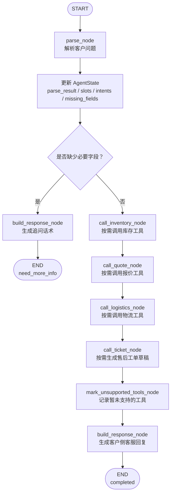

# 项目二 LangGraph 流程图

## 一句话说明

当前项目二已经从手写 workflow 升级出 LangGraph 版本。核心目标不是改变业务效果，而是把“解析问题、检查缺失字段、调用工具、生成客服回复”这条链路显式表达成 `State + Node + Edge`。

## 主流程图



## State 里保存什么

```text
question            用户原始问题
parse_result        解析结果，包括 intents、slots、missing_fields
tool_results        各工具返回结果
called_tools        本轮实际调用的工具
unsupported_tools   识别到但暂未支持的工具
customer_reply      客户侧回复
status              completed / need_more_info
execution_mode      langgraph
execution_trace     执行轨迹，记录 parse、guard、tool call、response
```

## Node 分工

```text
parse_node
  负责把客户自然语言解析成结构化信息。

call_inventory_node
  如果用户有库存意图，就调用 inventory_tool。

call_quote_node
  如果用户有报价意图，就调用 quote_tool。

call_logistics_node
  如果用户有物流意图，就调用 logistics_tool。

call_ticket_node
  如果用户有售后意图且订单号完整，就调用 ticket_tool 生成售后工单草稿。

mark_unsupported_tools_node
  记录当前还没有实现的工具。

build_response_node
  把缺失信息或工具结果整理成客户能看懂的客服话术。

execution_trace
  不是 LangGraph 节点，而是每个节点写入 State 的可解释记录。调试台会把它展示成步骤表和 JSON，评测脚本会检查它是否包含 parse、工具调用和 build_response。
```

## Edge 分支逻辑

```text
START -> parse

parse -> build_response
  条件：缺少必要字段，例如没有品质档位或数量。

parse -> call_inventory
  条件：字段完整，可以继续进入工具调用链路。

call_inventory -> call_quote -> call_logistics -> call_ticket -> mark_unsupported_tools -> build_response -> END
```

## 面试表达

可以这样讲：

> 我一开始先用手写 workflow 跑通业务闭环，确认库存、报价、物流和售后工单工具都能稳定工作。后面再把流程迁移到 LangGraph，把每一步拆成 Node，把当前任务上下文放在 State 里，用 Edge 表达缺信息追问和工具调用分支。现在每轮还会生成 execution_trace，把解析、拦截、工具调用和回复生成记录下来。这样既保留了确定性工具调用，也让 Agent 流程更容易扩展、测试和排错。对于退货、退款、换货这类高风险售后动作，Agent 只生成工单草稿，不直接承诺处理结果。
