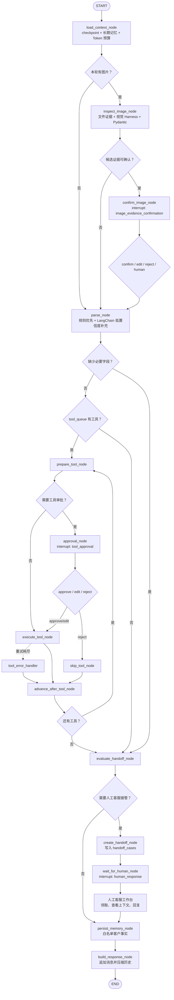

# 项目二 LangGraph 流程与生产级能力

## 一句话说明

LangGraph 是主编排层，负责 State、动态路由、checkpoint、失败恢复和三种可恢复暂停；LangChain 只放在智能节点内部，负责模型接口、Prompt、structured output 和 StructuredTool。客户图片确认、工具审批与人工客服接管是三个不同流程。

## 主流程图


```mermaid
flowchart TD
    START([START]) --> Context["load_context_node<br/>checkpoint + 长期记忆 + Token 预算"]
    Context --> HasImage{"本轮有图片？"}
    HasImage -- 否 --> Parse["parse_node<br/>规则优先 + LangChain 低置信度补充"]
    HasImage -- 是 --> Inspect["inspect_image_node<br/>文件证据 + 视觉 Harness + Pydantic"]
    Inspect --> VisualReady{"候选证据可确认？"}
    VisualReady -- 否 --> Parse
    VisualReady -- 是 --> ImageInterrupt["confirm_image_node<br/>interrupt: image_evidence_confirmation"]
    ImageInterrupt --> ImageDecision{"confirm / edit / reject / human"}
    ImageDecision --> Parse
    Parse --> Missing{"缺少必要字段？"}
    Missing -- 否 --> HasTool{"tool_queue 有工具？"}
    Missing -- 是 --> HandoffEval["evaluate_handoff_node"]
    HasTool -- 是 --> Prepare["prepare_tool_node"]
    HasTool -- 否 --> HandoffEval

    Prepare --> Approval{"需要工具审批？"}
    Approval -- 否 --> Execute["execute_tool_node"]
    Approval -- 是 --> ApprovalInterrupt["approval_node<br/>interrupt: tool_approval"]
    ApprovalInterrupt --> Decision{"approve / edit / reject"}
    Decision -- approve/edit --> Execute
    Decision -- reject --> Skip["skip_tool_node"]
    Execute -. 重试耗尽 .-> Error["tool_error_handler"]
    Execute --> Advance["advance_after_tool_node"]
    Skip --> Advance
    Error --> Advance
    Advance --> More{"还有工具？"}
    More -- 是 --> Prepare
    More -- 否 --> HandoffEval

    HandoffEval --> NeedHuman{"需要人工客服接管？"}
    NeedHuman -- 否 --> Memory["persist_memory_node<br/>白名单客户事实"]
    NeedHuman -- 是 --> Case["create_handoff_node<br/>写入 handoff_cases"]
    Case --> HumanInterrupt["wait_for_human_node<br/>interrupt: human_response"]
    HumanInterrupt --> Workbench["人工客服工作台<br/>领取、查看上下文、回复"]
    Workbench --> Memory
    Memory --> Reply["build_response_node<br/>追加消息并压缩历史"]
    Reply --> END([END])
```

## LangChain 与 LangGraph 的边界

- `langchain_adapter.py`：`ChatPromptTemplate + ChatModel + AgentParsePlan`。
- 高置信度规则结果直接返回，不发生模型调用。
- 低置信度或强制 LLM 模式才调用 LangChain structured output。
- 模型失败、超时、未配置 Key 时回退规则，并记录 `langchain_error`。
- `langchain_tools.py` 把五个现有函数公开为 `StructuredTool`。
- 模型不直接执行工具；LangGraph 仍负责 Pydantic 校验、审批、重试、幂等和错误分支。

## State 保存什么

```text
question / request_id / thread_id / session_id
approval_mode / handoff_mode / parser_mode / knowledge_mode / memory_mode
channel / customer_id / clarification_count / turn_count
messages / conversation_summary / conversation_slots
long_term_memories / memory_writes / context_snapshot
attachments / vision_results / vision_status / vision_error / vision_model_runtime
image_confirmation_request / image_confirmation_decisions / confirmed_visual_slots
parse_result / tool_queue / current_tool / pending_tool_arguments
tool_results / tool_arguments / called_tools / skipped_tools
unsupported_tools / tool_errors / tool_execution_keys
approval_request / approval_decisions
handoff_required / handoff_reason / handoff_id / handoff_status
handoff_priority / assigned_agent / human_reply / handoff_context
customer_reply / status / execution_mode / execution_trace
```

## 三种可恢复暂停

### 客户图片确认

`kind=image_evidence_confirmation`，用于视觉候选字段写入业务槽位前确认：

- `confirm`：确认品牌、机型、配件名和零件号候选。
- `edit`：客户修改字段后再写入。
- `reject`：撤回候选，不合并图片字段。
- `human`：请求人工客服核对图片。

图片二进制不进入 checkpoint，图中只保存证据 ID、结构化结果、确认决定和已确认字段。

### 工具审批

`kind=tool_approval`，用于报价和售后工具执行前审核：

- `approve`：按原参数执行。
- `edit`：修改参数，经 Pydantic 重验后执行。
- `reject`：不执行，写入 `skipped_tools`。

### 人工客服接管

`kind=human_response`，用于 Agent 无法可靠完成客户问题：

- 创建人工服务单并写入 `handoff_cases.sqlite3`。
- 携带问题、解析结果、工具参数、工具结果、错误、审批记录和建议回复。
- 图在 `wait_for_human_node` 暂停。
- 客服领取服务单并回复。
- `resume_handoff_agent` 使用同一 `thread_id` 恢复。
- 人工回复成为最终客户回复，服务单更新为 `resolved`。

恢复 API 会检查 interrupt 类型，不能把人工回复误提交给工具审批节点。

## 接管策略

确定性策略按以下优先级判断：

1. 客户明确要求人工或投诉。
2. 工具重试后仍失败。
3. 存在未接入能力。
4. 工具无匹配结果、RAG 证据不足或 RAG 需要人工确认。
5. 售后问题。
6. 适配和故障诊断。
7. 连续两次追问仍缺关键信息。
8. 无明确意图或解析置信度低于阈值。

普通库存、报价和物流查询不会为了展示功能而无条件转人工。

## Checkpoint 与业务队列

```text
logs/langgraph_checkpoints.sqlite3
```

负责图状态、节点历史、interrupt 和恢复。

```text
logs/handoff_cases.sqlite3
```

负责人工服务单、队列状态、负责人、人工回复和异步 outbox。

```text
logs/agent_memory.sqlite3
```

负责跨线程客户事实、过期状态、版本和变更审计。

三者不能互相替代。Checkpoint 不是长期客户画像或客服任务系统；长期记忆和人工服务单也不能恢复图执行位置。

## RAG knowledge_tool

`knowledge_tool` 复用项目一：

- Chroma 向量库。
- `BAAI/bge-small-zh-v1.5`。
- 同义词扩展。
- Top-K。
- 距离阈值与低置信度拒答。
- 来源、排名和距离元数据。

有生成模型时使用项目一 `answer_with_metadata`；没有 Key 时仅做真实检索并返回来源，随后安全转人工，不编造答案。

## 重试、失败与幂等

- 连接、超时和操作系统类临时错误最多尝试 3 次。
- 参数错误等不可重试异常直接进入错误处理。
- 重试耗尽后写入 `tool_errors`，接管模式下创建人工服务单。
- 工具幂等键由 `request_id + tool_name + arguments` 生成。
- 微信等非网页渠道的人工回复以 `handoff_id:human_reply` 作为 outbox 去重键。

## 自动验收

```powershell
cd "D:\new things\项目1\day1\project2"

& "..\.venv\Scripts\python.exe" tests\evaluate_agent.py --mode graph
& "..\.venv\Scripts\python.exe" tests\evaluate_agent.py --cases tests\agent_observability_cases.jsonl --mode graph
& "..\.venv\Scripts\python.exe" -m unittest tests.test_langgraph_runtime -v
& "..\.venv\Scripts\python.exe" -m unittest tests.test_context_memory -v
& "..\.venv\Scripts\python.exe" -m unittest tests.test_handoff_runtime -v
& "..\.venv\Scripts\python.exe" -m unittest tests.test_langchain_integration -v
& "..\.venv\Scripts\python.exe" tests\evaluate_handoffs.py
```

当前结果：

- 业务回归：30/30。
- 可解释性专项：5/5。
- LangGraph 运行时：6/6。
- 上下文与记忆：7/7。
- 人工接管运行时：6/6。
- LangChain/RAG 集成：7/7。
- 人工接管策略：9/9。

## 面试表达

> 我没有把项目二整体替换成黑盒 Agent。LangGraph 负责显式业务状态、动态路由、checkpoint、审批和人工接管；上下文管理器负责优先级、预算和压缩，长期记忆仓库只保存受治理的客户事实；LangChain 只负责模型抽象、低置信度语义解析和 StructuredTool schema。报价审批解决的是“AI 知道要做什么但需要授权”，人工接管解决的是“AI 无法可靠完成，需要真人直接回复”。
