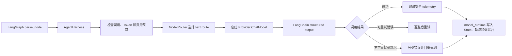

# ModelRouter 与 Harness 第一阶段

更新时间：2026-07-27

## 当前完成状态

Harness 第一阶段已经进入代码，并同时接入项目二 LangChain 文本解析和 LangGraph 图片识别链路。

已实现：

- `ModelRouter`：文本与视觉模型按能力路由，业务代码不再直接写死 Provider。
- Provider 预设：DeepSeek、智谱、阿里千问、腾讯 TokenHub、OpenAI 和自定义 OpenAI 兼容端点。
- 兼容原有 `DEEPSEEK_API_KEY`、`DEEPSEEK_MODEL` 和 `DEEPSEEK_BASE_URL`。
- 每个 Agent turn 的模型调用次数、输入 Token、输出预留 Token 和估算费用预算。
- 统一 timeout、重试次数、指数退避和同步并发限制。
- 统一错误分类：配置、预算、鉴权、限流、超时、连接、服务端 5xx、响应校验和未知错误。
- 鉴权错误和响应校验错误不重试；超时、连接、限流和 5xx 按策略重试。
- 安全 JSONL 模型日志，不保存原始问题、Prompt、上下文、图片或 API Key。
- 错误消息中的常见 API Key、Authorization 和 Token 自动脱敏。
- LangGraph State、执行轨迹、Streamlit 调试台和 CSV 运行日志展示 `model_runtime`。
- 没有 Key、预算不足或模型失败时，现有规则解析仍能接管。
- 视觉调用通过同一 Harness 记录 Provider、模型、尝试次数、估算 Token、延迟和分类错误，图片内容本身不写入 telemetry。

尚未实现：

- Provider 实际 Token usage 的统一采集；当前 Token 和费用是保守估算。
- 异步模型调用、分布式限流、熔断器和跨进程全局预算。
- 线上指标系统和告警。

## 代码位置

```text
model_router.py
agent_harness.py
langchain_adapter.py
vision_service.py
tests/test_model_harness.py
tests/test_multimodal_runtime.py
```

## 执行结构



## 默认路由

```text
text   -> deepseek / deepseek-v4-flash
vision -> zhipu / glm-4.1v-thinking-flash
```

本地视觉路由已经接通智谱。密钥只放在未提交 Git 的 `.env` 中；仓库里的 `.env.example` 不包含真实 Key。若部署环境未配置视觉 Key，文本路径仍可运行，图片请求会进入可解释失败和人工兜底。

## 环境变量

现有文本模型：

```dotenv
AGENT_TEXT_PROVIDER=deepseek
DEEPSEEK_API_KEY=your-key
DEEPSEEK_MODEL=deepseek-v4-flash
DEEPSEEK_BASE_URL=https://api.deepseek.com
AGENT_TEXT_TIMEOUT_SECONDS=30
AGENT_TEXT_MAX_RETRIES=1
AGENT_TEXT_MAX_OUTPUT_TOKENS=800
```

每轮 Harness 预算：

```dotenv
AGENT_MAX_MODEL_CALLS=2
AGENT_MAX_MODEL_INPUT_TOKENS=6000
AGENT_MAX_MODEL_OUTPUT_TOKENS=2000
AGENT_MAX_ESTIMATED_COST_CNY=0.25
AGENT_MAX_MODEL_CONCURRENCY=2
AGENT_MODEL_BACKOFF_SECONDS=0.5
AGENT_MODEL_LOG_ENABLED=true
AGENT_MODEL_LOG_PATH=logs/model_calls.jsonl
```

费用估算只有在填写 Provider 当前价格时才有意义：

```dotenv
AGENT_TEXT_INPUT_COST_PER_1M_CNY=0
AGENT_TEXT_OUTPUT_COST_PER_1M_CNY=0
```

价格为 `0` 表示免费或价格未知，Harness 仍然执行调用次数和 Token 预算，但费用上限不会拦截该路由。

## 国内视觉模型选择

### 当前实测：智谱 GLM-4.1V-Thinking-Flash

适合作为项目第一版：

- 已用项目的铭牌和零件标签合成样例完成真实 API 调用。
- 当前项目已经预置 Provider、Base URL 和实测模型名。
- 只需要开通智谱开放平台并在本地配置 `ZHIPU_API_KEY`。

```dotenv
AGENT_VISION_PROVIDER=zhipu
ZHIPU_API_KEY=your-zhipu-key
AGENT_VISION_MODEL=glm-4.1v-thinking-flash
```

首次接入曾尝试 `glm-4.6v-flash`，平台返回 `429 / 1305 model overloaded`；这属于服务可用性信号，不等于模型能力结论。当前默认改为已实际跑通的 `glm-4.1v-thinking-flash`，后续仍应使用同一图片评测集对比 Provider，而不是只看模型宣传页。

可选对比：

```dotenv
AGENT_VISION_MODEL=glm-4.6v-flash
```

轻量基础对照：

```dotenv
AGENT_VISION_MODEL=glm-4v-flash
```

“免费”仍受平台速率限制和服务政策影响，上线前必须再次查看控制台。

### 推荐二：阿里千问 Qwen3-VL-Flash

适合作为第二个评测 Provider：

- 中文图片理解和多图输入能力适合铭牌、标签和旧件照片。
- 支持 OpenAI 兼容接口。
- 阿里百炼北京地域的新用户通常按模型提供独立免费额度，通常为 100 万 Token，有效期 90 天。
- 它属于新人限时额度，不是永久免费。

```dotenv
AGENT_VISION_PROVIDER=qwen
DASHSCOPE_API_KEY=your-dashscope-key
AGENT_VISION_MODEL=qwen3-vl-flash
AGENT_VISION_BASE_URL=https://dashscope.aliyuncs.com/compatible-mode/v1
```

部分新版业务空间会显示包含 `WorkspaceId` 的 API Host，应以创建 Key 时控制台显示的地址为准。建议在百炼控制台开启“免费额度用完即停”。

### 推荐三：腾讯 TokenHub

可用于第三组对照：

- TokenHub 提供图片和视频理解模型。
- 当前新人体验政策中，多模态理解模型提供 100 万 Token，有效期一年。
- 免费额度耗尽后，在未开启后付费的情况下服务停止。

```dotenv
AGENT_VISION_PROVIDER=tencent
TENCENT_TOKENHUB_API_KEY=your-tokenhub-key
AGENT_VISION_MODEL=hy-vision-2.0-instruct
AGENT_VISION_BASE_URL=https://tokenhub.tencentmaas.com/v1
```

### 本地开源模型

Qwen2.5-VL、Qwen3-VL 等开源权重可以本地运行，不需要 API Key，也没有按次 API 费用，但需要显存、模型下载、推理服务和部署维护。当前项目第一版更适合先用免费云 API 建评测集，再根据隐私、费用和硬件条件决定是否本地化。

## API Key 应该怎么提供

不要把真实 Key 发到聊天、README、截图或 Git 仓库。

推荐操作：

1. 在对应平台开通模型并创建 API Key。
2. 打开本地文件 `D:\new things\项目1\day1\.env`。
3. 按选定 Provider 添加两行配置。
4. 告诉 Codex“Key 已配置”，不需要提供 Key 明文。

选择智谱时，代码已经有默认 Base URL 和默认视觉模型，因此秘密信息确实只需要一个 `ZHIPU_API_KEY`；还需要一行非秘密配置 `AGENT_VISION_PROVIDER=zhipu`。

## 自动验收

Harness 专项：

```powershell
cd "D:\new things\项目1\day1\project2"
& "..\.venv\Scripts\python.exe" -m unittest tests.test_model_harness -v
```

全部单元与集成测试：

```powershell
& "..\.venv\Scripts\python.exe" -m unittest discover -s tests -p "test_*.py" -v
```

当前结果：

- Harness 专项：11/11。
- 全部运行时与集成测试：66/66。
- 多模态运行时专项：10/10。
- 合成图片真实 API 冒烟评测：4/4，不代表真实业务准确率。
- 40 张开放许可真实候选预跑：40/40；API/解析错误 0。
- workflow 业务回归：30/30。
- LangGraph 业务回归：30/30。
- workflow/LangGraph 可解释性专项：各 5/5。
- Streamlit AppTest：0 个未捕获异常。

## 网页验收

1. 启动项目二调试台。
2. 选择“规则解析”，运行一个高置信度问题。
3. 在“解析结果”页查看“模型 Harness”，应显示本轮没有调用模型。
4. 选择“LangChain 解析”并运行问题。
5. 配置有效文本 Key 时，应看到 Provider、模型、调用次数、尝试次数、输入 Token 和估算费用。
6. 临时移除 Key 后再次运行，应回退规则，并显示 `configuration` 错误分类。
7. 切换到 LangGraph，上传零件标签图片并确认候选字段。
8. 在“图片证据”页查看视觉 Provider、模型、状态、耗时、置信度和确认记录。
9. 查看 `logs/model_calls.jsonl`，其中只有 trace、Provider、模型、状态、耗时和估算用量，不应出现客户问题、图片二进制或 API Key。

## 官方资料

以下页面在 2026-07-27 核对：

- [智谱视觉模型列表](https://docs.bigmodel.cn/cn/guide/start/model-overview)
- [智谱 GLM-4V-Flash](https://docs.bigmodel.cn/cn/guide/models/free/glm-4v-flash)
- [阿里百炼新人免费额度](https://help.aliyun.com/zh/model-studio/new-free-quota/)
- [千问 VL OpenAI 兼容调用](https://help.aliyun.com/en/model-studio/qwen-vl-compatible-with-openai)
- [腾讯 TokenHub 新人免费体验包](https://cloud.tencent.com/document/product/1823/130053)
- [腾讯 TokenHub 多模态理解](https://cloud.tencent.com/document/product/1823/130988)
