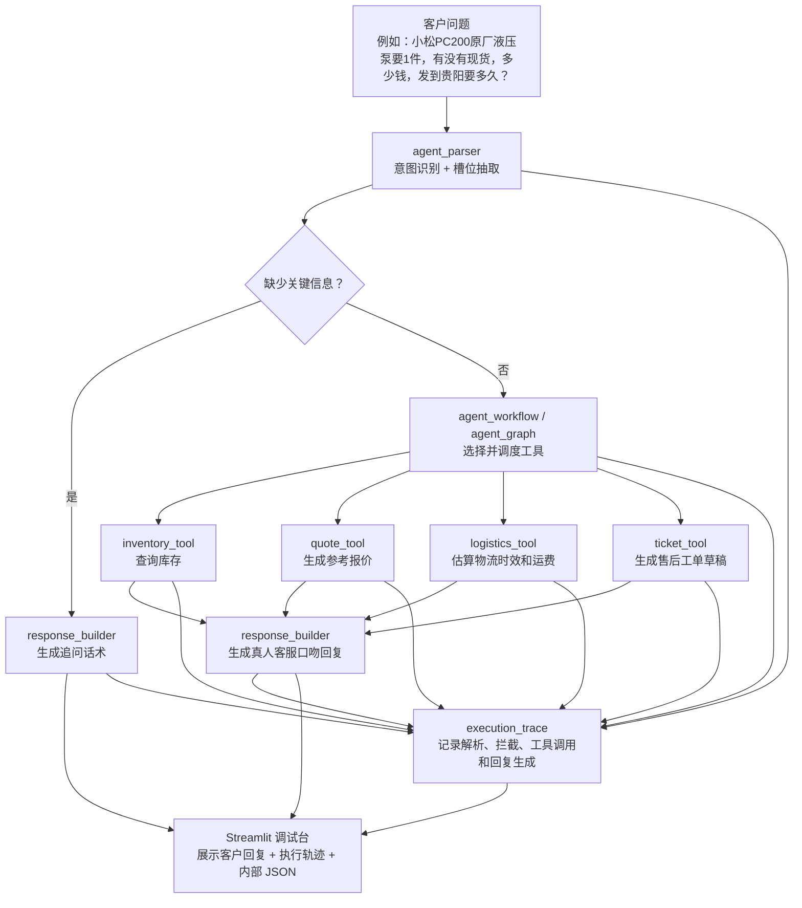
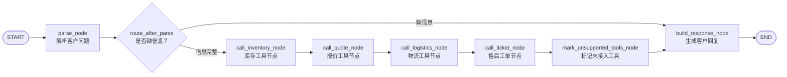

# 挖机配件多工具销售 Agent 流程图

更新时间：2026-06-17

## 1. 当前业务闭环



## 2. LangGraph 版本节点图



## 3. State / Node / Edge 对应关系

```text
State：保存当前任务状态
- question：原始客户问题
- parse_result：意图、槽位、缺失字段
- tool_results：库存、报价、物流工具返回值
- called_tools：本轮实际调用的工具
- unsupported_tools：识别到了但暂未接入的工具
- customer_reply：最终给客户看的回复
- execution_trace：内部执行轨迹，用于解释每一步决策和工具调用

Node：每个处理步骤
- parse_node：调用 agent_parser.parse_customer_question()
- call_inventory_node：调用 inventory_tool
- call_quote_node：调用 quote_tool
- call_logistics_node：调用 logistics_tool
- call_ticket_node：调用 ticket_tool
- build_response_node：调用 response_builder.build_customer_reply()

Edge：节点之间的流转规则
- START -> parse_node
- 如果缺字段：parse_node -> build_response_node
- 如果信息完整：parse_node -> 工具节点 -> build_response_node
- build_response_node -> END
```

## 4. 面试表达

项目二第一版先用手写 workflow 跑通业务闭环，确认库存、报价、物流、售后工单工具和客服话术都稳定。

随后我把同一套逻辑迁移到 LangGraph：把任务状态抽象成 State，把每个步骤抽象成 Node，把“信息不足先追问、信息完整再调用工具”的判断抽象成 Edge。迁移后仍然复用原来的 30 条测试集，workflow 模式和 LangGraph 模式都能达到 30/30，通过率 100%。

这说明 LangGraph 不是为了套框架，而是在业务闭环已经稳定后，用图结构增强流程可维护性、可解释性和后续扩展能力。

新增 `execution_trace` 后，手写 workflow 和 LangGraph 都会输出同样结构的执行轨迹。面试时可以直接展示 `parse -> call_tool -> build_response` 或 `parse -> guard_missing_fields -> build_response`，说明系统为什么调用工具，为什么不调用工具，以及客户侧回复如何生成。
