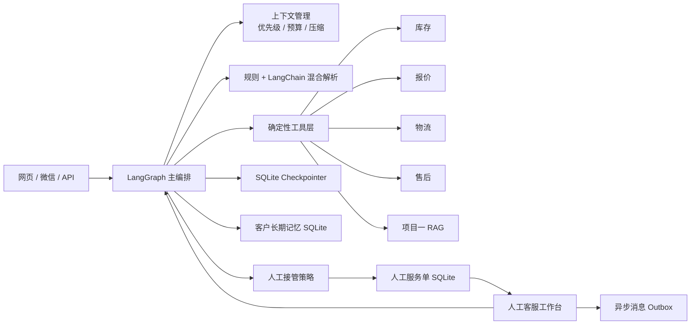

# 挖机配件多工具销售 Agent 流程图

更新时间：2026-07-26

## 1. 系统分层


```mermaid
flowchart LR
    Channel["网页 / 微信 / API"] --> Graph["LangGraph 主编排"]
    Graph --> Context["上下文管理<br/>优先级 / 预算 / 压缩"]
    Graph --> Parse["规则 + LangChain 混合解析"]
    Graph --> Tools["确定性工具层"]
    Graph --> Checkpoint["SQLite Checkpointer"]
    Graph --> Memory["客户长期记忆 SQLite"]
    Graph --> Handoff["人工接管策略"]
    Tools --> Inventory["库存"]
    Tools --> Quote["报价"]
    Tools --> Logistics["物流"]
    Tools --> Ticket["售后"]
    Tools --> Knowledge["项目一 RAG"]
    Handoff --> Queue["人工服务单 SQLite"]
    Queue --> Workbench["人工客服工作台"]
    Workbench --> Graph
    Workbench --> Outbox["异步消息 Outbox"]
```

## 2. LangChain 与 LangGraph

LangChain：

- ChatModel 与 Prompt。
- Pydantic structured output。
- StructuredTool schema。
- 项目一 RAG/Retriever 能力。

LangGraph：

- AgentState。
- Node 与 conditional edge。
- 动态工具队列。
- SQLite checkpoint。
- 同线程消息、摘要和已确认槽位。
- 上下文 Token 预算与 Prompt Injection 防护。
- 跨线程客户记忆的隔离、过期和审计。
- 工具审批 interrupt。
- 人工回复 interrupt。
- RetryPolicy、错误处理和幂等。

模型负责理解，图负责控制，确定性工具负责业务数据。

## 3. 两种人工介入

```text
工具审批：
AI 知道要调用 quote/ticket，但执行前需要 approve/edit/reject。

人工接管：
AI 无法可靠解决，创建 handoff case，由人工客服直接回复客户。
```

人工接管触发后，State、人工服务单和执行轨迹都会记录原因。客服回复后用相同 `thread_id` 恢复。

## 4. 当前验证

- workflow 业务回归：30/30。
- LangGraph 业务回归：30/30。
- 可解释性专项：5/5。
- LangGraph 运行时：6/6。
- 上下文与记忆：7/7。
- 人工接管运行时：6/6。
- LangChain/RAG 集成：7/7。
- 人工接管策略：9/9。

详细实现见：

```text
docs/langgraph_flow.md
docs/langchain_integration.md
docs/human_handoff.md
docs/context_memory.md
docs/demo_script.md
```
