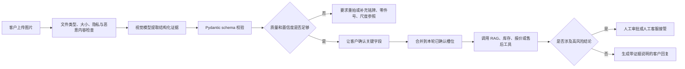
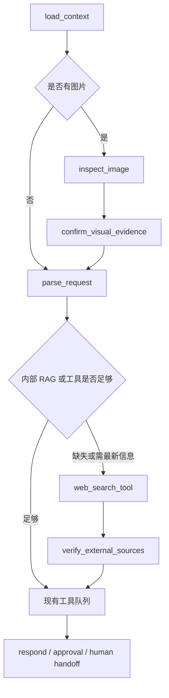

# 多模态与网页搜索升级方案

更新时间：2026-07-27

## 结论

项目二值得增加图片理解和网页搜索，但两者都应作为受控工具接入，不应直接替换现有工作流。

- 图片理解适合做“证据提取和槽位补全”，暂时不应独立做最终适配、故障定责、报价或售后承诺。
- 网页搜索适合补充“知识库没有或容易过期的公开信息”，库存、订单、内部价格和客户资料仍必须来自内部工具。
- 当前 DeepSeek 文本链路可以保留。新增独立 `vision_model` 和 `search_provider`，由模型路由按任务选择，不需要一次性替换底层模型。
- 所有图片结果和网页结果都属于不可信上下文，必须经过 schema 校验、置信度门控、来源验证和必要的人工确认。

截至 2026-07-27，ModelRouter、Harness 第一阶段和多模态最小闭环已经进入代码；图片上传、视觉调用、客户确认、低质量拒识、人工接管和首批合成图片评测均已跑通。网页搜索仍是尚未实现的下一阶段。面试中可以展示图片闭环，但必须说明当前 4 张合成图只是接口与安全冒烟评测，不是生产准确率。

## 为什么图片理解适合当前业务

挖机配件客服经常遇到客户不知道标准配件名、只发旧件照片、铭牌照片或损坏照片的情况。图片不是聊天页面里的装饰，而是补全业务证据的重要输入。

### 高价值场景

| 场景 | 图片模型负责什么 | 后续动作 | 风险边界 |
| --- | --- | --- | --- |
| 设备铭牌 | OCR 提取品牌、机型、序列号、发动机型号 | 请求客户确认后写入本轮槽位 | 模糊字符不得猜测 |
| 旧件或包装标签 | 提取零件号、品牌、标签文字 | 用零件号查询 RAG、库存或适配资料 | 零件号必须逐字符核对 |
| 配件外观 | 描述接口、油口、插头、安装位置和可见特征 | 生成补拍清单或人工核对任务 | 不能只凭外观承诺适配 |
| 故障与损坏 | 描述漏油、裂纹、磨损、缺件和包装破损等可见现象 | 创建售后服务单并附证据摘要 | 不能替代专业故障诊断和定责 |
| 订单或物流截图 | 提取订单号、运单号和状态文字 | 调用订单或物流工具核验 | 上传和日志中要保护个人信息 |
| 多张对比图 | 比较新旧件、接口和标签差异 | 输出差异点并转人工确认 | 不自动生成最终采购结论 |

### 不建议第一版做的内容

- 根据一张低清照片直接识别唯一配件并承诺可安装。
- 仅凭照片判断内部故障、维修责任或质保责任。
- 从图片中读取一个疑似零件号后直接报价和下单。
- 自动把原图、手机号、地址或订单截图永久写入长期记忆。
- 第一版直接处理完整视频。视频可以后续拆成关键帧，再沿用图片流程。

## 图片处理工作流



建议新增结构化结果：

```text
ImageInspectionResult
  image_type
  extracted_text
  brand
  machine_model
  part_name_candidate
  part_number
  visible_damage
  image_quality
  confidence
  warnings
  required_followups
  safe_for_auto_merge
```

建议向 LangGraph State 增加：

```text
attachments
vision_results
evidence_ids
vision_confidence
image_consent
image_retention_until
```

其中 `safe_for_auto_merge=false` 的字段只能作为候选信息，不得覆盖客户已确认信息。零件号、机型和订单号应优先让客户确认；若新图片与历史槽位冲突，应记录冲突并以当前客户明确确认的内容为准。

## 图片数据治理

- 原图放对象存储或独立文件存储，不把二进制图片写入 SQLite checkpoint。
- State、日志和服务单只保存 `evidence_id`、受控访问地址、哈希、提取摘要和过期时间。
- 使用文件大小、MIME、扩展名和解码结果做组合校验。
- 清理 EXIF，并对手机号、地址、身份证号等敏感内容做遮盖或限制展示。
- 按 `customer_id` 和 `session_id` 隔离，禁止跨客户访问。
- 设置保留期限和删除入口；长期客户记忆只保存客户确认且在白名单内的业务事实。
- 图片内容、OCR 文本和模型描述都按不可信数据处理，不能覆盖系统规则或发起未授权工具调用。

## 图片能力怎么评测

第一版准备 30 到 50 组真实或脱敏图片，至少覆盖清晰铭牌、模糊铭牌、反光、旋转、局部遮挡、旧件标签、损坏件和无关图片。

核心指标：

- OCR 字段准确率：品牌、机型、零件号分别统计，零件号采用严格字符匹配。
- 槽位 precision/recall：不能只统计“有没有输出”，还要统计是否误填。
- 虚构零件号率：目标应接近 0；看不清时必须返回未知。
- 低质量拒识率：模糊、反光、遮挡时是否正确要求重拍。
- 高风险拦截率：是否阻止图片直接触发最终报价、适配承诺或售后定责。
- 客户隔离：跨客户图片和结果泄漏必须为 0。
- 延迟、单次成本和失败回退率。

## 网页搜索能解决什么

网页搜索不是替代 RAG。内部知识先查 RAG 和业务工具，只有问题依赖最新公开信息、内部知识缺失或已经过期时，才进入搜索。

### 适合搜索

- 厂商官网的配件目录、服务公告、技术通告和公开说明书。
- 官方发布的型号变更、兼容性说明、召回或安全提示。
- 官方经销商、服务网点和公开联系方式。
- 影响交付的公开天气、道路或物流时效信息，正式系统优先接专用物流 API。
- 公开的运输、安全和监管要求。
- 罕见零件号的公开资料定位，结果只作为候选证据。

### 不应该搜索

- 公司实时库存、内部价格、订单状态和客户售后记录。
- 客户手机号、地址、订单详情等敏感信息。
- 依赖搜索结果自动承诺现货、最终价格、适配或质保结论。
- 把随机电商标题、论坛帖子或短视频文案当成唯一适配证据。
- 未经审核就把搜索网页自动写入长期记忆或正式 RAG 知识库。

## 网页搜索工作流

建议将 `web_search_tool` 设计为只读 StructuredTool，由 LangGraph 决定是否调用。

建议输入：

```text
query
purpose
allowed_domains
freshness
max_results
customer_safe_query
```

建议输出：

```text
results:
  title
  url
  snippet
  published_at
  retrieved_at
  source_tier
search_status
warnings
```

调用条件：

1. 当前问题明确要求最新信息。
2. 内部 RAG 没有可靠证据。
3. 内部资料标记为已过期，需要公开来源复核。

控制要求：

- 优先使用厂商、政府、物流服务商等域名白名单。
- 回答必须显示来源 URL 和检索时间。
- 高风险结论至少需要官方来源，必要时采用两个独立来源或转人工。
- 查询前去除客户隐私和内部数据。
- 对页面文本继续执行 Prompt Injection 检测。
- 限制搜索次数、结果数、超时、费用和缓存期限。
- 记录搜索查询、命中来源、筛选理由和最终使用了哪些证据。

## 是否需要替换 DeepSeek

不建议现在全量替换。

当前 DeepSeek 链路已经承担文本意图解析、结构化输出、RAG 回答和 Tool Calling，并且已有完整回归测试。图片能力和网页搜索是两个独立能力：

- 能看图，不等于能搜索网页。
- 能搜索网页，不等于应该访问内部系统。
- 一个模型支持多模态，也不等于它在中文铭牌 OCR、零件号识别、成本和延迟上最适合本项目。

推荐采用模型路由：

```text
text_model     = DeepSeek，负责现有文本解析和回复
vision_model   = 可配置的视觉 Provider，负责图片证据提取
search_provider = 独立搜索 Provider 或模型内置搜索工具
fallback_model = 可选，只在主 Provider 失败时启用
```

当前已经新增 `model_router.py`、`agent_harness.py`、`vision_service.py` 和 `image_evidence.py`。业务节点通过统一路由获取模型，现有 DeepSeek 文本链路保持兼容；智谱视觉路由已用 `glm-4.1v-thinking-flash` 跑通，千问和腾讯 TokenHub 保留为后续对照。不能假设所有厂商特有参数都能经由同一个兼容接口使用。

视觉模型的最终选择不靠宣传参数，而靠项目自己的小型基准集：

- 中文铭牌 OCR 和字母数字混排准确率。
- 零件号不确定时能否拒绝猜测。
- 多图对比效果。
- 结构化输出稳定性。
- 国内网络可用性、数据合规、延迟和成本。

候选可以包括当前支持图像输入的 OpenAI 模型、Gemini 或通义千问视觉模型。模型名通过环境变量配置，避免业务代码依赖某个会变化的具体版本。

## 与当前架构怎么结合

现有 LangGraph 不需要改成多 Agent。第一版只要增加受控节点和工具：



这与现有能力的关系：

- `context_manager.py` 继续定义优先级，并把图片和搜索结果视为不可信上下文。
- `schemas.py` 增加视觉和搜索输入输出 schema。
- `langchain_tools.py` 注册只读搜索工具；视觉分析更适合作为图节点或独立服务。
- `execution_trace.py` 记录模型路由、图片证据、搜索来源、置信度和拦截原因。
- `handoff_policy.py` 增加低清图片、零件号冲突、来源不足和高风险结论的接管原因。
- `memory_repository.py` 不直接保存原图和未经确认的视觉推断。

## 建议实施顺序

### P0：Harness 第一阶段，已完成

已经实现模型路由、Provider 配置、超时、重试、同步并发、单轮调用次数、Token/估算费用预算、统一错误分类和脱敏调用日志。结构化解析和 Pydantic 校验已经进入 Harness，非 JSON/JSONDecodeError 可受控重试；当前专项测试为 11/11。分布式限流、熔断和跨进程总预算留到图片评测之后继续补充。

### P1：多模态最小闭环，已完成

已完成 JPG/PNG/WebP 上传、图片证据提取、Pydantic 校验、客户确认、低质量重拍和人工接管，覆盖铭牌、旧件标签和损坏证据三个场景。原图独立存储，不进入 State；客户确认通过 LangGraph interrupt/checkpoint 恢复。

### P2：多模态评测，真实候选预跑已完成、业务金标待补

首批 4 张合成图片已通过真实 API 冒烟评测；40 张开放许可真实机械候选已完成来源/许可清单、EXIF 清理、双人标注模板、gold 门禁和在线预跑，40/40 无 API/解析错误，P50 9.83 秒、P95 17.53 秒。下一步完成双人裁决，再加入 20-30 张经授权脱敏的挖机业务图片，重点观察零件号严格匹配、幻觉率、低质量拒识率和失败回退率。通过后再扩大图片证据与库存、RAG 和售后的联动。

### P3：受控网页搜索

新增只读 `web_search_tool`、域名白名单、引用、缓存、隐私过滤、注入检测和搜索轨迹。先演示“内部 RAG 无答案后搜索官方资料并转人工确认”。

### P4：Skills 与有限多角色

把“配件适配核对”“售后证据收集”等稳定流程封装为 Skill。只有评测证明单图工作流或技术诊断确实需要角色隔离时，再增加一个专用技术诊断 sub-agent；完整多 Agent 后置。

## 验收清单

多模态：

1. 支持三种常见图片格式并拒绝异常文件。
2. 输出严格符合 `ImageInspectionResult`。
3. 模糊图片不猜零件号，回复明确要求重拍。
4. 图片推断不会静默覆盖客户已确认槽位。
5. 图片不能直接触发最终适配、报价、退款或定责。
6. 原图不写入 checkpoint 和长期记忆。
7. 调试台可查看证据摘要、置信度、警告和模型路由。
8. 图片 Provider 失败时能回退到文字补充或人工客服。
9. 跨客户证据隔离测试通过。
10. 图片基准集生成字段准确率、幻觉率、延迟和成本报告。

网页搜索：

1. 内部 RAG 足够时不调用搜索。
2. 只有需要最新或缺失公开信息时才搜索。
3. 查询不包含客户隐私和内部数据。
4. 默认限制到可信域名和结果数量。
5. 客户回复展示来源和检索时间。
6. 搜索页面中的指令不能覆盖系统规则。
7. 搜索结果不能自动写入长期记忆或生产知识库。
8. 搜索超时或无可靠来源时转人工，不编造答案。
9. 工具日志包含查询、来源、筛选理由、耗时和费用。
10. 高风险结论的来源与人工审批策略测试通过。

## 面试表达

可以这样说：

> 我没有为了加入多模态就把现有 DeepSeek 文本链路全部替换。现有模型在文本解析和工具规划上已有稳定回归，所以我把文本模型、视觉模型和搜索 Provider 解耦，由 LangGraph 根据输入和证据缺口路由。视觉模型只提取铭牌、零件号和损坏现象等候选证据，经过 Pydantic、置信度门控和客户确认后才能进入业务槽位；网页搜索只补充官方的最新公开信息，并保留来源、时间和完整轨迹。最终库存、报价、适配和售后仍由确定性工具与人工审批控制。

## 官方资料

以下资料在 2026-07-27 核对：

- [DeepSeek API 模型与能力说明](https://api-docs.deepseek.com/quick_start/pricing/)
- [OpenAI 图像与视觉输入指南](https://developers.openai.com/api/docs/guides/images-vision)
- [OpenAI Web Search 工具指南](https://developers.openai.com/api/docs/guides/tools-web-search)
- [LangChain 模型 Provider 与统一接口](https://docs.langchain.com/oss/python/concepts/providers-and-models)
- [Gemini 图像理解指南](https://ai.google.dev/gemini-api/docs/image-understanding)
- [通义千问视觉模型应用说明](https://help.aliyun.com/zh/model-studio/call-single-agent-application)
